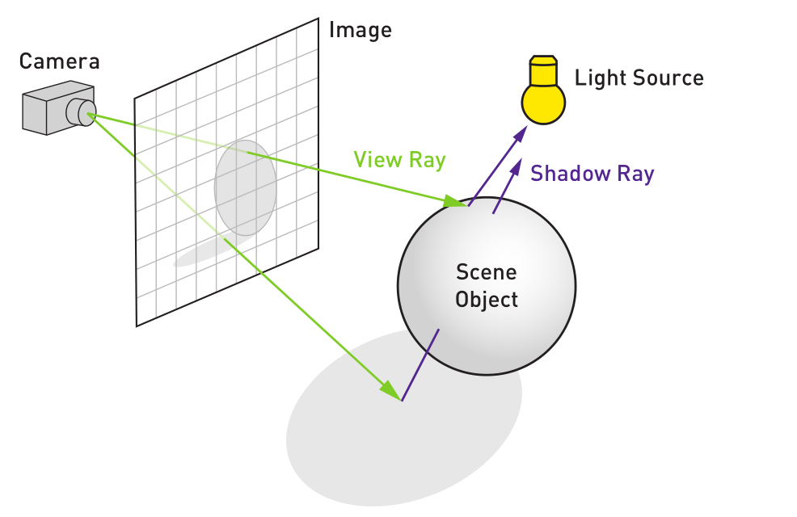
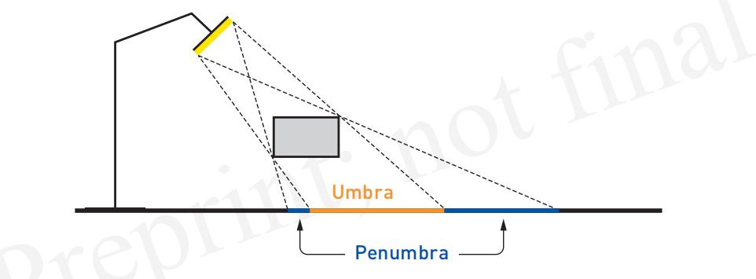

# 第一章 光线追踪术语

## 概要

## 1.1 历史笔记

光线跟踪（Ray tracing）在跟踪环境中的光线移动的光的学科中具有丰富的历史，通常称为辐射传输（radiative transfer）。 图形从业者从中子传输[^2]，热传输[^6]和照明工程学[^11]等领域引进了思想。 由于许多领域都研究了这些概念，术语在学科之间和学科内部不断发展，有时也会产生分歧。经典的论文爷可能会错误地使用术语，这可能会造成混淆。

沿光线运动的光的基本量是国际单位制的光谱辐射率（spectral radiance），其沿着光线（在真空中）保持恒定并且通常表现得像感知概念上的亮度一样。 在术语被标准化之前，光谱辐射通常被称为“强度”（intensity）或“亮度”（brightness）。在计算机图形学中，我们通常忽略单词“spectral”，因为非光谱辐射（non-spectral radiance）是所有波长的体积量，从来不会被使用。

与光线（ray）相关的图形学特定术语随着时间的推移进行着不断发展。 几乎所有现代光线追踪器都是使用递归和蒙特卡罗方法的; 但是现在已经很少会有人把他们称为“递归的蒙特卡洛”追踪器。 1968年，Appel [^1]使用光线渲染图像。 1979年，Whitted [^ 16]和Kay和Greenberg [^ 9]开发了递归光线追踪来描绘准确的折射和反射。 1982年，Roth [^13]使用了光线和外部区间列表以及局部实例，创建了CSG模型的渲染（和体积估计）。

1984年， Cook 等人 [^4]提出了分布式光线线追踪（distributed or distribution ray tracing）。 但是，这种方法通常被称为随机光线跟踪（stochastic ray tracing），来避免与分布式处理（distributed processing）混淆。 几乎每一个现代光线追踪器都使用随机采样来实现诸如景深（ depth of field），模糊反射（fuzzy reflections）和柔和阴影（ soft shadows）等效果。 在1984年之后的几年里，研究人员使用传统的辐射传递（ radiative transfer methods）方法重新描述了渲染。 1986年引入了两个重要的算法.Kajiya [^8]将积分输运方程(integral transport equation)称为渲染方程(rendering equation.)。 他尝试了各种解决方案，包括一种名为路径追踪(path tracing)的蒙特卡罗方法。 Immel, Cohen, and Greenberg[^7]用不同的单位编写了相同的传输方程，并用现在称为辐射度的有限元方法求解。

自从三十年前使用经典传输方法重新描述图形问题以来，已经有大量的工作探索了如何在数字上解决问题。 关键的算法变化包括20世纪90年代引入的双向（ bidirectional ）[^10,14]和基于路径的[^15]方法。 Pharr，Jakob和Humphreys的书[^12]中讨论了许多细节，包括如何在实践中实施这些技术。

## 1.2 Definitions

我们要重点强调一些在我们书中经常用到的重要术语。除了标准化单位的术语外，不存在任何标准术语集，但我们的定义反映了该领域的当前用法。

光线投射（Ray tracing）是一个寻找沿着光的最近，有些时候是线路上任何物体的过程。可以参考第二章对于光线的定义。光线离开相机穿过像素直到它击中离他最近的物体。在这个点上，会有一个射向光源的新的光线产生来判断物体是否是在阴影下，见图1。

光线追踪使用光线投射的机制，递归的来收集来自放射和折射的光对物体提供的贡献度。例如，当遭遇到镜子的时候，光线从镜子和自己相交的点沿着反射方向进行投射。无论反射光线与什么相交，都会最终影响镜子的着色效果。同样，透明或玻璃物体也可能产生反射光线和折射光线。这个过程是递归发生的，每一条新光线都可能产生额外的反射和折射光线。递归通常有一些停止的限制，比如最大的反弹次数。这种光线沿着其链条倒推回去以产生这个点的颜色。 如前所述，可以通过向每个光源投射光线来询问每个交叉点是否被遮蔽。 见图1.2。

在whitted或者经典的光线追踪当中，表面被当作拥有完美的亮光和平滑度，并且光源使用方向和极小点来表示。在Cook or stochastic ray tracing,大多数的光线能够从光线簇的结点发射出来，这能产生多种多样的效果。例如，想象一个球形光而不是点光源。 表面现在可以被部分照亮，因此我们可以向球体上的不同位置发射大量光线，来估计光照到达的程度。 当整合区域光线能见度时，完全阴影点位于本影; 部分点亮的点位于半影内。 见图1.3。

通过围绕反射方向在锥形区域内拍摄大量光线并混合结果，我们得到光泽而不是镜像反射。 见图1.4。 这种传播样本的想法也可用于模拟半透明度，景深和运动模糊效果。
在现实世界中，许多光源发出光，通过各种方式（包括折射和反射）向眼睛发光。

有光泽的表面在许多方向上反射光线，而不仅仅是沿着反射方向; 漫反射或无光表面使光线分散在更广泛的范围内。 在路径追踪中，我们使用出射方向和材料来反转光的散射行为，以帮助确定各种入射方向对曲面阴影的重要性。

跟踪这种复杂的光传输很快变得势不可挡，并且很容易导致低效的渲染。要创建图像，我们只需要从一组特定方向通过相机镜头的光线。各种形式的递归光线追踪会逆转物理过程，从我们知道会影响图像的方向产生来自眼睛的光线。
在Kajiya风格或路径跟踪中，光线反射场景中的无光泽表面，允许现实世界中的所有光路（衍射之外的相位效果除外）。这里的路径指的是一系列光 - 物体相互作用，它们从相机开始并以光线结束。

这里的工作短语是“可以” - 如果我们从粗糙表面上的交叉点拍摄一组，比如一千条光线，那么对于每条光线，我们递归地再发送一千条光线，一直持续到光线 每个光线都会遇到光源，我们几乎可以永远计算出一个像素。 相反，当从眼睛投射光线并击中可见表面时，路径跟踪器将从表面以有用的方向产生一条光线。 反过来，这条光线会产生一条新的光线，一组射线形成一条路径。 将像素跟踪的多个路径混合在一起可以估算出像素的真实辐亮度，随着评估更多路径，结果会得到改善。 路径追踪可以在适当的情况下提供无偏见的结果，一个匹配的物理现实。

每个表面交叉点位置需要估计来自其周围所有方向的光的贡献，并结合其表面的反射特性。例如，白色天花板旁边的红色墙壁会将红光反射到天花板上，反之亦然。壁和天花板之间发生进一步的相互反射，因为每个进一步反射这种反射光，然后可以影响另一个。通过从眼睛的视图递归地总结这些效果，仅在遇到光时终止，可以形成真实的，基于物理的图像。

大多数现代光线追踪器使用每个像素不止一个光线作为底层蒙特卡罗（MC，Monte Carlo）算法的一部分。 Cook风格和Kajiya风格的算法就是例子。 这些方法都对某些空间的各种概率密度函数（PDF， probability density functions ）有一定的了解。 例如，在Cook式光线跟踪器中，我们可能会在镜头区域包含一个PDF文件。在基于路径的方法中，PDF将覆盖路径空间中的路径。

通过使用蒙特卡罗算法的不均匀采样PDF来减少误差的方法被称为重要性采样（importance sampling）。 使用具有数论方法的样本的低差异模式而不是传统的伪随机数生成器来创建随机样本被称为准蒙特卡罗（QMC，Quasi-Monte Carlo ）采样。 计算机图形从业者在很大程度上使用MC和QMC领域的标准术语。 但是，这种做法会引起令人困惑的同义词。 例如，图形中的“带阴影射线直接照射”是MC / QMC中“next event estimation”的示例。

从形式上看，渲染器正在解决传输方程，通常也称为图形特定问题的渲染方程（rendering equation）。 渲染方通常被写为表面上某点的能量平衡方程。 文献中的符号略有不同，但与此形式的相似性越来越高：

$$L_{0}(p,\omega_{0})=L_{e}(p,\omega_{0})+\int_{\xi^{2}}f_{r}(p,w_{i}\rightarrow w_{0})L_{i}(p,\omega_{i})cos\theta d\omega_{i}$$

这里，$L_{o}$是在方向$ω_{o}$处的点$P$处离开表面的辐射度（radiance），并且表面特性f是双向反射分布函数（BRDF）。该函数通常也用$fr$或$ρ$表示。另外，$L_{i}$是沿着方向$ω_{i}$的入射光，并且表面法线和入射光方向之间的角度是$θ_{i}$，$|cosθ_{i}|$是考虑到这个角度导致的几何衰减的分量。我们通过整合来自不光有光源的所有表面和物体的光的效果，和在所有进入的方向和折叠表面的BRDF的效果获得了辐射度（radiance），也就是颜色。由于$L_{i}$通常是递归计算的，也就是从点P可见的所有表面必须依次计算他们自己的辐射度，路径追踪(path tracing)和跟它有关的相关方法用于在所有可能的路径中进行选择一条效果最好的递归道路。

位置点*P*通常被忽略成隐含的。 此外，可以添加波长λ作为函数输入。 还有更多的一般方程包括参与介质，如烟雾或雾，以及物理光学效应，如衍射。

与参与的媒介相关的是，Ray marching是沿着光线行进一段时间的过程，沿着光线的方向对其进行采样。 这种投射光线的方法通常用于体绘制，其中没有特定的表面。 相反，在每个位置，通过某种方式计算光对体积的影响。 Ray marching的替代方案是模拟体积中的碰撞。

Ray marching，通常是Hart的球体追踪算法（sphere tracing algorithm ）[^5]的某些变体，也用于描述由隐式距离方程或内部/外部测试定义的表面的交叉过程，通过沿着射线的采样点搜索表面。 在这种情况下，“球体”是一个距离表面等距点的球体; 它与相交的球体无关。 按照我们之前的表示法，这个过程理想地称为“球体投射”而不是“球体追踪”（sphere casting）（sphere tracing）。这种类型的交叉测试常见于demoscene程序，并由Shadertoy网站在线推广。

我们已经触及了与光线相关的渲染技术和使用的术语的基础知识。更多指南，请参阅本书的网站http://raytracinggems.com。

## References

[^1]: Appel, A. Some Techniques for Shading Machine Renderings of Solids. InAFIPS ’68 Spring Joint Computer Conference (1968), pp. 37–45.
[^2]: Arvo, J., and Kirk, D. Particle Transport and Image Synthesis. Computer Graphics (SIGGRAPH) 24, 4 (1990), 63–66.
[^ 3]: Cook, R. L. Stochastic Sampling in Computer Graphics. ACM Transactions on Graphics 5, 1 (Jan. 1986), 51–72.
[^4]: Cook, R. L., Porter, T., and Carpenter, L. Distributed Ray Tracing.Computer Graphics (SIGGRAPH) 18, 3 (1984), 137–14
[^ 5]: Hart, J. C. Sphere Tracing: A Geometric Method for the Antialiased RayTracing of Implicit Surfaces. The Visual Computer 12, 10 (Dec 1996), 527–545.
[^ 6]: Howell, J. R., Menguc, M. P., and Siegel, R. Thermal Radiation Heat Transfer. CRC Press, 2015.
[^ 7]: Immel, D. S., Cohen, M. F., and Greenberg, D. P. A Radiosity Methodfor Non-Diffuse Environments. Computer Graphics (SIGGRAPH) 20, 4 (Aug.1986), 133–142.
[^ 8]: Kajiya, J. T. The Rendering Equation. Computer Graphics (SIGGRAPH)(1986), 143–150.
[^ 9]: Kay, D. S., and Greenberg, D. Transparency for Computer SynthesizedImages. Computer Graphics (SIGGRAPH) 13, 2 (1979), 158–164.
[^ 10]: Lafortune, E. P. Bidirectional Path Tracing. In Compugraphics (1993),pp. 145–153.
[^ 11]: Larson, G. W., and Shakespeare, R. Rendering with Radiance: The Art and Science of Lighting Visualization. Booksurge LLC, 2004. 
[^ 12]: Pharr, M., Jakob, W., and Humphreys, G. Physically Based Rendering:From Theory to Implementation, third ed. Morgan Kaufmann, 2016.
[^13]:  Roth, S. D. Ray Casting for Modeling Solids. Computer Graphics and Image Processing 18, 2 (1982), 109–144.
[^14]:  Veach, E., and Guibas, L. Bidirectional Estimators for Light Transport. In Photorealistic Rendering Techniques (1995), pp. 145–167.
[^15]:  Veach, E., and Guibas, L. J. Metropolis Light Transport. In Proceedings of SIGGRAPH (1997), pp. 65–76.
[^16]:  Whitted, T. An Improved Illumination Model for Shaded Display. Communications of the ACM 23, 6 (June 1980), 343–34