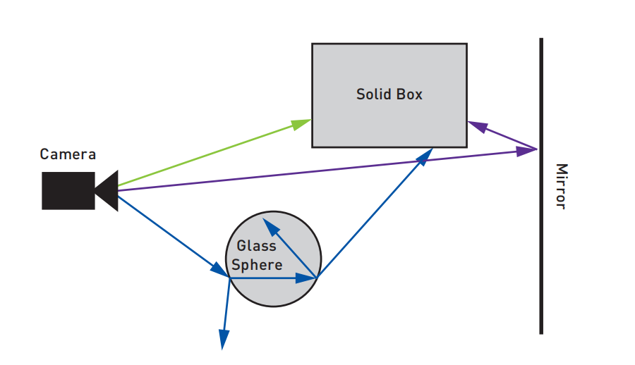

# 第一章 光线追踪术语

## 概要

## 1.1 历史笔记

光线跟踪（Ray tracing）在跟踪环境中的光线移动的光的学科中具有丰富的历史，通常称为辐射传输（radiative transfer）。 图形从业者从中子传输[^2]，热传输[^6]和照明工程学[^11]等领域引进了思想。 由于许多领域都研究了这些概念，术语在学科之间和学科内部不断发展，有时也会产生分歧。经典的论文爷可能会错误地使用术语，这可能会造成混淆。

沿光线运动的光的基本量是国际单位制的光谱辐射率（spectral radiance），其沿着光线（在真空中）保持恒定并且通常表现得像感知概念上的亮度一样。 在术语被标准化之前，光谱辐射通常被称为“强度”（intensity）或“亮度”（brightness）。在计算机图形学中，我们通常忽略单词“spectral”，因为非光谱辐射（non-spectral radiance）是所有波长的体积量，从来不会被使用。

与光线（ray）相关的图形学特定术语随着时间的推移进行着不断发展。 几乎所有现代光线追踪器都是使用递归和蒙特卡罗方法的; 但是现在已经很少会有人把他们称为“递归的蒙特卡洛”追踪器。 1968年，Appel [^1]使用光线渲染图像。 1979年，Whitted [^ 16]和Kay和Greenberg [^ 9]开发了递归光线追踪来描绘准确的折射和反射。 1982年，Roth [^13]使用了光线和外部区间列表以及局部实例，创建了CSG模型的渲染（和体积估计）。

1984年， Cook 等人 [^4]提出了分布式光线线追踪（distributed or distribution ray tracing）。 但是，这种方法通常被称为随机光线跟踪（stochastic ray tracing），来避免与分布式处理（distributed processing）混淆。 几乎每一个现代光线追踪器都使用随机采样来实现诸如景深（ depth of field），模糊反射（fuzzy reflections）和柔和阴影（ soft shadows）等效果。 在1984年之后的几年里，研究人员使用传统的辐射传递（ radiative transfer methods）方法重新描述了渲染。 1986年引入了两个重要的算法.Kajiya [^8]将积分输运方程(integral transport equation)称为渲染方程(rendering equation.)。 他尝试了各种解决方案，包括一种名为路径追踪(path tracing)的蒙特卡罗方法。 Immel, Cohen, and Greenberg[^7]用不同的单位编写了相同的传输方程，并用现在称为辐射度的有限元方法求解。

**

自从三十年前使用经典传输方法重新描述图形问题以来，已经有大量的工作探索了如何在数字上解决问题。 关键的算法变化包括20世纪90年代引入的双向（ bidirectional ）[^10,14]和基于路径的[^15]方法。 Pharr，Jakob和Humphreys的书[^12]中讨论了许多细节，包括如何在实践中实施这些技术。

## 1.2 Definitions

我们要重点强调一些在我们书中经常用到的重要术语。除了标准化单位的术语外，不存在任何标准术语集，但我们的定义反映了该领域的当前用法。

## References

[^1]: Appel, A. Some Techniques for Shading Machine Renderings of Solids. InAFIPS ’68 Spring Joint Computer Conference (1968), pp. 37–45.
[^2]: Arvo, J., and Kirk, D. Particle Transport and Image Synthesis. Computer Graphics (SIGGRAPH) 24, 4 (1990), 63–66.
[^ 3]: Cook, R. L. Stochastic Sampling in Computer Graphics. ACM Transactions on Graphics 5, 1 (Jan. 1986), 51–72.
[^4]: Cook, R. L., Porter, T., and Carpenter, L. Distributed Ray Tracing.Computer Graphics (SIGGRAPH) 18, 3 (1984), 137–14
[^ 5]: Hart, J. C. Sphere Tracing: A Geometric Method for the Antialiased RayTracing of Implicit Surfaces. The Visual Computer 12, 10 (Dec 1996), 527–545.
[^ 6]: Howell, J. R., Menguc, M. P., and Siegel, R. Thermal Radiation Heat Transfer. CRC Press, 2015.
[^ 7]: Immel, D. S., Cohen, M. F., and Greenberg, D. P. A Radiosity Methodfor Non-Diffuse Environments. Computer Graphics (SIGGRAPH) 20, 4 (Aug.1986), 133–142.
[^ 8]: Kajiya, J. T. The Rendering Equation. Computer Graphics (SIGGRAPH)(1986), 143–150.
[^ 9]: Kay, D. S., and Greenberg, D. Transparency for Computer SynthesizedImages. Computer Graphics (SIGGRAPH) 13, 2 (1979), 158–164.
[^ 10]: Lafortune, E. P. Bidirectional Path Tracing. In Compugraphics (1993),pp. 145–153.
[^ 11]: Larson, G. W., and Shakespeare, R. Rendering with Radiance: The Art and Science of Lighting Visualization. Booksurge LLC, 2004. 
[^ 12]: Pharr, M., Jakob, W., and Humphreys, G. Physically Based Rendering:From Theory to Implementation, third ed. Morgan Kaufmann, 2016.
[^13]:  Roth, S. D. Ray Casting for Modeling Solids. Computer Graphics and Image Processing 18, 2 (1982), 109–144.
[^14]:  Veach, E., and Guibas, L. Bidirectional Estimators for Light Transport. In Photorealistic Rendering Techniques (1995), pp. 145–167.
[^15]:  Veach, E., and Guibas, L. J. Metropolis Light Transport. In Proceedings of SIGGRAPH (1997), pp. 65–76.
[^16]:  Whitted, T. An Improved Illumination Model for Shaded Display. Communications of the ACM 23, 6 (June 1980), 343–34